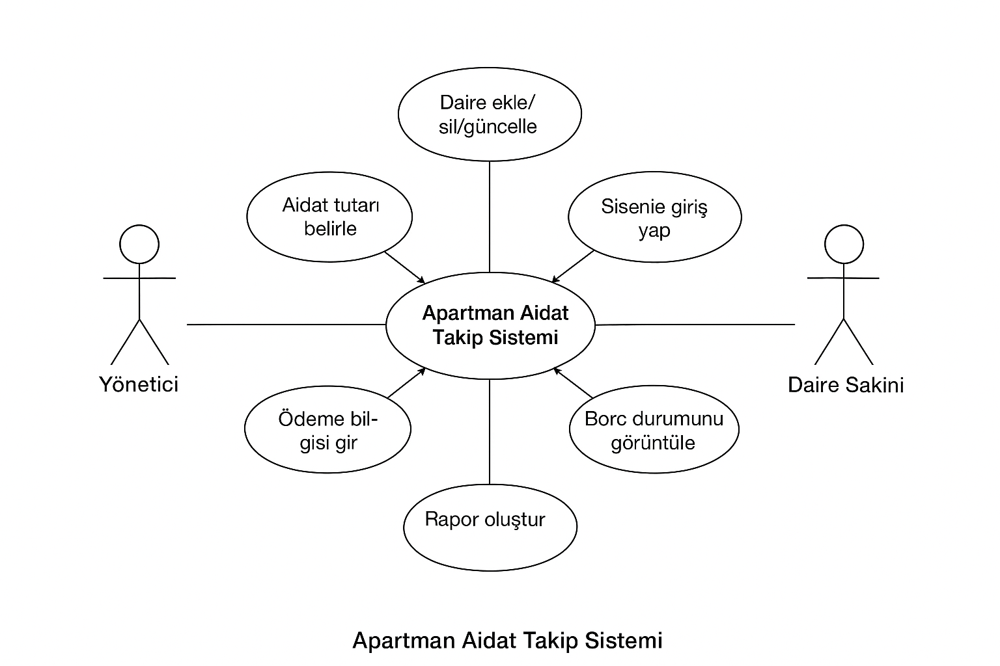

# 🏢 Apartman Aidat Takip Sistemi

Bu proje, **Sistem Analizi ve Tasarımı** dersi kapsamında hazırlanmış olup apartman yöneticilerinin daire sakinleriyle ilgili **aidat, borç, ödeme ve gecikme** bilgilerini dijital ortamda kolayca yönetebilmesini sağlamayı amaçlamaktadır.

---

## 📘 Proje Özeti

Geleneksel yöntemlerde aidat takibi genellikle defter veya Excel dosyalarıyla manuel olarak yapılmakta, bu da zaman kaybına ve hatalara neden olmaktadır.  
Bu sistem sayesinde her daire için aylık aidat bilgileri kaydedilmekte; ödemesini yapan, geciken veya borçlu olan sakinler otomatik olarak listelenmektedir.  

Sistemde iki temel kullanıcı rolü vardır:  
- 🧑‍💼 **Yönetici**: Daire bilgilerini ekler, aidat tutarını belirler, ödeme bilgilerini girer ve rapor oluşturur.  
- 🏠 **Daire Sakini**: Sisteme giriş yaparak kendi borç durumunu ve geçmiş ödemelerini görüntüler.  

Bu yapı apartman yönetiminde şeffaflığı sağlar, verileri düzenli tutar ve yöneticinin iş yükünü azaltır.

---

## 🎯 Amaç ve Hedefler

Projenin amacı; apartman yöneticilerinin aidat, borç ve ödeme işlemlerini dijital ortamda **hızlı, hatasız ve şeffaf** biçimde yönetebilmesini sağlamaktır.  
Hedef; manuel işlemleri ortadan kaldırarak zaman tasarrufu ve kolay takip imkânı sunmaktır.

---

## 🧩 Kullanılan Diyagramlar

- ✅   
- 🔁   
- 🧱   

Tüm diyagramlar bu projeye dahil edilmiştir.

---

## 🗂️ Dosya Listesi

| Dosya Adı | Açıklama |
|------------|-----------|
| `Apartman_Aidat_Takip_Sistemi_Proje_Formu.docx` | Proje bilgi formu |
| `UseCase.png` | Kullanım senaryosu diyagramı |
| `DFD.png` | Veri akış diyagramı |
| `ER.png` | Veritabanı diyagramı |

---

## 🚀 Yazar
👤 **Muhammed Öncül**  
📘 Bilgisayar Teknolojileri Bölümü
